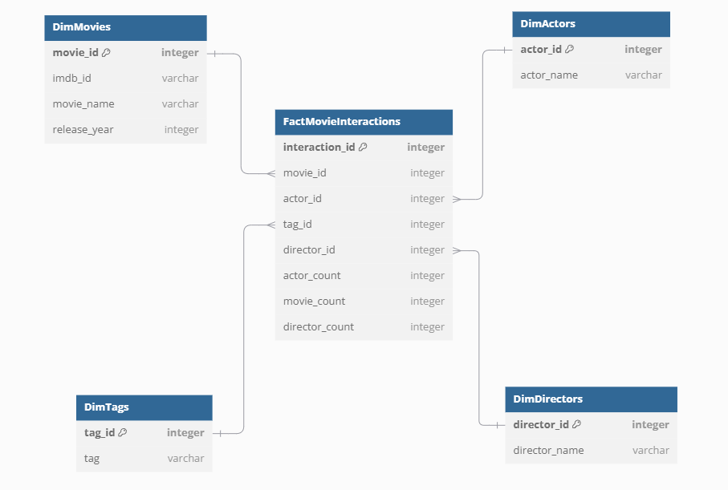
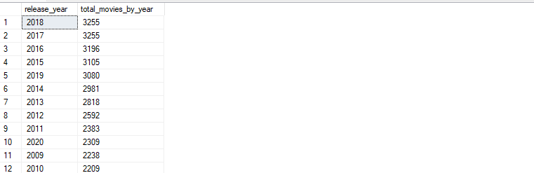
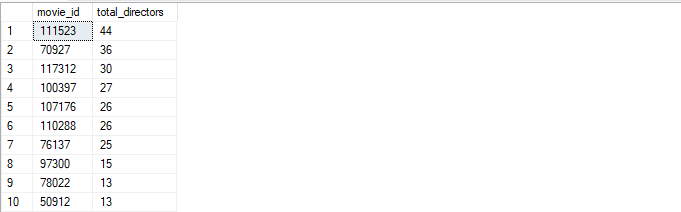

# Movie Interactions Data Warehouse

## Overview
This document provides an overview of the SQL schema and queries for managing movie interactions within a data warehouse.

 It includes table definitions, data insertions, and aggregation queries, facilitating the analysis of movie-related data.
## Star Schema


## Table Definitions

### 1. Dimension Tables
Dimension tables are essential for storing descriptive attributes related to the facts.

These attributes provide context and meaning to the data, enabling comprehensive analysis.

#### Dimension Table: DimActors
```sql
CREATE TABLE DimActors (
    actor_id INT PRIMARY KEY,          
    actor_name VARCHAR                 
);
```

#### Dimension Table: DimDirectors
```sql
CREATE TABLE DimDirectors (
    director_id INT PRIMARY KEY,      
    director_name VARCHAR              
);
```

#### Dimension Table: DimMovies
```sql
CREATE TABLE DimMovies (
    movie_id INT PRIMARY KEY,         
    imdb_id VARCHAR,                   
    movie_name VARCHAR,                
    release_year INT                  
);
```

#### Dimension Table: DimTags
```sql
CREATE TABLE DimTags (
    tag_id INT PRIMARY KEY,           
    tag VARCHAR                        
);
```

#### Dimension Table: DimUsers
```sql
CREATE TABLE DimUsers (
    user_id INT PRIMARY KEY           
);
```

### 2. FactMovieInteractions
The `FactMovieInteractions` table records interactions related to movies, actors, and directors. 

It captures quantitative data that can be analyzed to gain insights into user interactions with movies.

```sql
CREATE TABLE FactMovieInteractions (
    interaction_id INT PRIMARY KEY,     
    movie_id INT,                      
    actor_id INT,                     
    director_id INT,                  
    actor_count INT,                   
    movie_count INT,                
    director_count INT,               
    FOREIGN KEY (movie_id) REFERENCES DimMovies(movie_id),
    FOREIGN KEY (actor_id) REFERENCES DimActors(actor_id),
    FOREIGN KEY (director_id) REFERENCES DimDirectors(director_id)
);
```

#### Notes:
- **`interaction_id`**: This column serves as a unique identifier for each interaction recorded in the table.
- **`movie_id`**, **`actor_id`**, **`director_id`**: These foreign keys link to their respective dimension tables, allowing for detailed relational analysis.
- **`actor_count`**, **`movie_count`**, **`director_count`**: These columns hold aggregated counts that help in analyzing interactions, facilitating deeper insights into the relationships among movies, actors, and directors.

---

## Insertion Queries

Insertion queries are crucial for populating the fact and dimension tables with relevant data. 

They establish relationships and facilitate meaningful analysis of movie interactions.

### Insertion 1: Movie Counts by Year
The first insertion populates the `FactMovieInteractions` table with movie counts grouped by release year.

```sql
INSERT INTO FactMovieInteractions (interaction_id, movie_id, actor_id, director_id, movie_count)
SELECT 
    ROW_NUMBER() OVER (ORDER BY m.release_year) AS interaction_id,
    m.movie_id,
    NULL AS actor_id,
    NULL AS director_id,
    COUNT(m.movie_id) OVER (PARTITION BY m.release_year) AS movie_count
FROM DimMovies m;
```

## Bridge Tables

#### 1. BridgeActorMovies
Before the second insertion, we create the `BridgeActorMovies` table to establish a relationship between movies and actors.

```sql
-- Create a temporary table for distinct entries
CREATE TABLE #DistinctMovieActor (movie_id INT, actor_id INT);

-- Insert distinct pairs into the temporary table
INSERT INTO #DistinctMovieActor (movie_id, actor_id)
SELECT DISTINCT movie_id, actor_id
FROM WowMovies.dbo.MovieActor;

-- Now insert into BridgeActorMovies from the temporary table
INSERT INTO BridgeActorMovies (movie_id, actor_id)
SELECT ma.movie_id, ma.actor_id
FROM #DistinctMovieActor ma
WHERE NOT EXISTS (
    SELECT 1
    FROM BridgeActorMovies b
    WHERE b.movie_id = ma.movie_id AND b.actor_id = ma.actor_id
);


DROP TABLE #DistinctMovieActor;
```
#### 2. BridgeActorDirector
```sql
INSERT INTO BridgeDirectorMovies (movie_id, director_id)
SELECT md.movie_id, md.director_id
FROM WowMovies.dbo.MovieDirector md;
```

### Insertion 2: Director Counts
This section updates the `FactMovieInteractions` table with the director counts based on data from `BridgeDirectorMovies`.

```sql
UPDATE f
SET f.director_count = b.director_count
FROM FactMovieInteractions f
JOIN (
    SELECT 
        b.movie_id,
        COUNT(b.director_id) AS director_count
    FROM 
        BridgeDirectorMovies b
    GROUP BY 
        b.movie_id
) b ON f.movie_id = b.movie_id;
```


## Aggregation Queries

Aggregation queries allow for the analysis of the data by summarizing and counting records, providing insights into various aspects of movie interactions.

### 1. Total Interaction Count
To get the total number of interactions:

```sql
SELECT COUNT(interaction_id) AS total_interactions
FROM movie_interactions;
```


### 2. Total Movies By Year
```sql
SELECT distinct D.release_year, F.movie_count AS total_movies_by_year
FROM FactMovieInteractions F 
LEFT join DimMovies D on D.movie_id = F.movie_id
ORDER BY movie_count DESC;
```


### 3. Total directors by Movie
```sql
SELECT distinct F.movie_id, F.director_count AS total_directors
FROM FactMovieInteractions F 
LEFT join DimDirectors D on D.movie_id = F.movie_id
ORDER BY director_count DESC;
```



### Note on Bridge Tables

**Bridge Tables** play a vital role in establishing many-to-many relationships between dimension tables in a data warehouse. In the context of the `Movie Interactions Data Warehouse`, the `BridgeActorMovies` table is used to connect movies and actors, allowing for the representation of multiple actors associated with a single movie and vice versa. 

#### Purpose of Using Bridge Tables:
Bridge tables simplify complex relationships by breaking them into manageable parts, ensuring easier analysis of interactions.

They maintain data integrity through foreign keys, which enforce referential integrity between linked tables, guaranteeing consistent and accurate data.

 Additionally, bridge tables facilitate efficient data aggregation for reporting and analysis by enabling join operations without duplicating data in dimension tables.

## Conclusion
This document serves as a guide to understanding the structure and functionality of the `FactMovieInteractions` Data Warehouse Start Schema. 

The provided SQL queries facilitate data insertion, manipulation, and aggregation for comprehensive movie interaction analysis.

