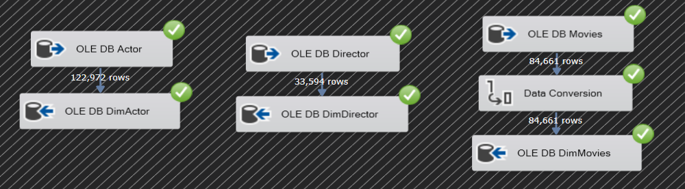

# SSIS Packages for Data Transfer

## Movies, Actors, and Directors Package

### Description:
This package transfers data related to movies, actors, and directors from the source tables into their respective dimensional tables in the data warehouse:
- **Actors Data Transfer**: Moves 122,972 rows from the `Actor` table to `DimActor`.
- **Directors Data Transfer**: Moves 33,594 rows from the `Director` table to `DimDirector`.
- **Movies Data Transfer**: Transfers 84,661 rows from the `Movies` table, with a data conversion step, into the `DimMovies` table.

## Tags and Users Package

### Description:
This package handles the transfer of data related to tags and users from the source tables into their respective dimensional tables in the data warehouse:
- **Tags Data Transfer**: Moves 1,094 rows from the `Tags` table into the `DimTags` table.
- **Users Data Transfer**: Transfers 247,383 rows from the `Users` table into the `DimUsers` table.

The goal is to populate the dimensional tables with data from the operational database for analysis and reporting.

