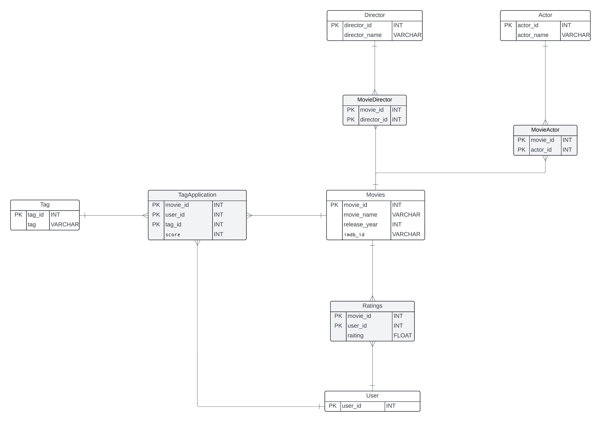

## Grand Now Schema

## Queries

### Q1: Movies with Specific Titles and Directors

**Description**: Movies that contain the words 'Lord of The rings' or 'Harry Potter' with their director, released after the year 2001, in descending order.

### Q2: Top 5 Actors by Movie Count

**Description**: Retrieve the top 5 actors by the number of movies they have appeared in, skipping the actor with the highest count.

### Q3: Top 3 Movies with Most Actors

**Description**: Top 3 movies with the highest number of actors.

### Q4: Total Ratings Count and Average Rating for Top Movies

**Description**: Total ratings count and average rating for the top 10 movies.

### Q5

**Description**: Retrieve the total ratings count and average rating for the top 10 movies, filtering for movies with an average rating greater than 4.3, and sorting by total ratings in ascending order.

### Q6: Top 5 Movies with High Ratings

**Description**: Retrieve the top 5 movies with an average rating greater than 4.2 and a total ratings count between 1000 and 5000, including total ratings count and average rating for each movie, ordered by total ratings in ascending order.

### Q7: Most Frequently Used Tags

**Description**: Identify the top 7 most frequently used tags across all movies, ordered by usage_count in descending order to highlight the most popular tags.

### Q8: Directors with the highest-rated movies

**Description**: Retrieve the directors with the highest-rated movies by calculating the average rating of the movies directed by each director.

### Q9: Movies without rating 

**Description**: Retrieves a list of movies that have not received any ratings

### Q10: Actors who have worked with the most directors

**Description**: Retrieves a list of actors who worked with the most directors orderd by the nubers of directors 

### Q11: The distribution of ratings for each movie

**Description**: shows how many times each rating has been given to each movie. It helps to see how people feel about each film.

### Q12: Actors who have the highest average ratings across all their movies

**Description**: Finds the average rating of movies for each actor, showing which actors are in movies that people like the most.....

