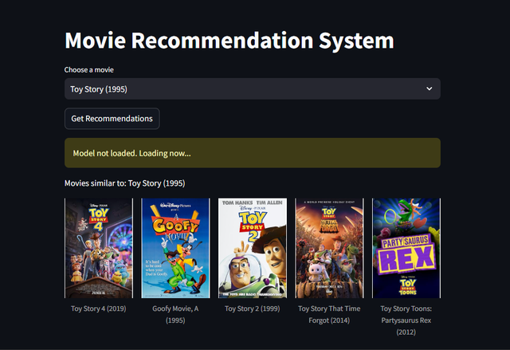
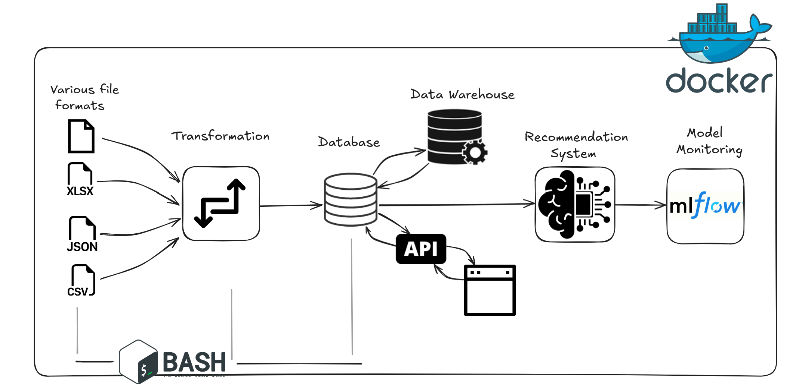

# End-to-End Movie Data Processing and Recommender System
This project covers the complete data life cycle from extraction to the deployment of a recommender system. It includes data extraction, transformation, loading into a database, integration into a data warehouse, and ultimately using the data for recommendations. The entire process is automated and incorporates a machine learning model for generating personalized recommendations, providing a comprehensive solution for movie data analysis and user engagement.

### Table of Contents

- [End-to-End Movie Data Processing and Recommender System](#end-to-end-movie-data-processing-and-recommender-system)
    - [Table of Contents](#table-of-contents)
  - [Project Overview](#project-overview)
  - [Installation](#installation)
  - [Data Life Cycle](#data-life-cycle)
  - [Data Sources](#data-sources)
  - [Data Transformation](#data-transformation)
  - [Database Setup](#database-setup)
  - [Data Warehouse](#data-warehouse)
  - [Recommender Model](#recommender-model)
  - [Technologies Used](#technologies-used)
  - [Contributers](#contributers)

## Project Overview
<div style="text-align: center;">
    
</div>

## Installation
1. Clone the Repository:
```bash
git clone https://github.com/your-repo/movie-recommender.git
cd movie-recommender
```
2. Install Dependencies: This project uses Poetry for dependency management. Install it if you don’t have it already:
```sh
curl -sSL https://install.python-poetry.org | python3 -
poetry install
```
3. Set Up Environment Variables: Create a .env file in the root directory and add the following variables:
```makefile
MOVIE_DATA_PATH=metadata_with_imdb_metadata.csv
EMBEDDING_MODEL=all-MiniLM-L6-v2
MODEL_PATH=models/
FAISS_INDEX_FILE=faiss_index.bin
EMBEDDINGS_FILE=movie_embeddings.pkl
MLFLOW_TRACKING_URI=http://localhost:5000
MLFLOW_EXPERIMENT_NAME=movie_recommender
MLFLOW_RUN_NAME=faiss_recommender
```

## Data Life Cycle

This project covers the complete data life cycle from extraction to the deployment of a recommender system. It includes data extraction, transformation, loading into a database, integration into a data warehouse, and ultimately using the data for recommendations.


## Data Sources

The data is sourced from various formats including:
- JSON
- CSV
- XLSX

These files contain different aspects of movie data, which are standardized for further processing. The data is received daily at 1 AM. 

The automation scheduling is handled by the following scripts:
- `automate_transformation.sh`: This script processes and transforms the incoming data.
- `daily_schedule.sh`: This script schedules the automation to ensure data is processed and stored in its respective date-specific folder.

For more details on the automation, see the [Preprocessing_scripts](./Preprocessing_scripts) folder.

The [log_files](./log_files) folder contains execution output logs of the data processing. These logs document the processing activities but do not include the data itself.

## Data Transformation

1. **Standardization**: The initial step involved transforming all incoming data formats into a consistent format.
2. **Metadata Adjustment**: A metadata file containing key movie data was modified to ensure completeness and accuracy.
3. **Normalization**: The data was normalized to ensure it was suitable for loading into the database.

For more details on the transformation scripts, visit the [Preprocessing_scripts](./Preprocessing_scripts) folder.


## Database Setup

The normalized data was stored in the `Database_all_in` folder, which contains:
- **Queries**: SQL queries for data retrieval and manipulation.
- **Schema and Creation**: Scripts for creating the database schema and initial data loading.

The database was designed to efficiently store and retrieve movie-related data. More details can be found in the [Database_all_in](./Database_all_in) folder.

## Data Warehouse

After setting up the database, the data was loaded into a data warehouse located in the [DWH](./DWH) directory. This warehouse is designed using a star schema, which organizes data into fact tables and dimension tables. 

This facilitates easier analysis and reporting, as well as integration with analytical tools. For more information, check the [DWH](./DWH) folder.


## Recommender Model

Following the data warehouse setup, the next steps involve leveraging this data to build a recommender system. The scripts related to the recommender model can be found in the [Recommender_system](./Recommender_system) folder.

## Technologies Used

The following technologies were used to build this project:
- SQL
- SSIS
- Python 3.8
- Pandas
- Poetry for dependency management
- SQLAlchemy for database interaction with SQL Server
- FastAPI
- Bash
- Sentence Transformers for generating embeddings
- Faiss for similarity search
- MLflow for model tracking and experiment logging
- Streamlit for building the user interface

## Contributers

- [Morsi Mohsen](https://github.com/morsimohsen)
- [Salah Mohamed](https:gt//github.com/codsalah)
- [Shahd Hamdi](https://github.com/shahdhamdi)
- [Mohamed Elgohary](https://github.com/MohamedElgohary918)
- [Alyaa Mahmoud](https://github.com/ALYAA-MAHMOOD)